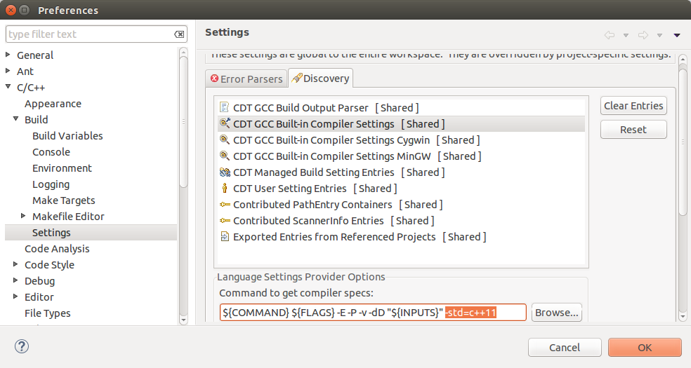

# How to set up Eclipse CDT Makefile project to run with Google Test and C++11

This is the basic set up for the EPL course. Tools used

- Eclispe + CDT
- custom template makefile provided by professor
- GCC with C++11 support
- Google Test C/C++ unit testing framework

Projects come in the form of standard `Makefile` + `.cpp` / `.h` file to implement + `unittest.cpp` files.

## System Requirement
This guide works on my system setting, which is Ubuntu 14.04 + Eclipse Luna. It might not work exactly the same on Windows.

## Prepare Eclipse workspace
Before opening up any projects, one should first set the global properties of the Eclipse workspace. Go to `Window/Preferences`. Find menu

> **C / C++ >> Build >> Setting**, select `Discovery` Tab.

Select entry **CDT GCC Built-In Compiler Settings** because I am using native Linux GCC, not Cygwin or MinGW GCC. Append `-std=c++11` to the end of the build command.

## Import Project and Project Setting

With the workspace ready, we import the project by choosing to import`Existing Code as Makefile Project`. This step is self-evident.

After that, if you try to build the system, chances are it will fail with one thousand errors and warnings.  We must make various settings before it will compile and link properly. We take on a **Problem-to-Solution approach** at this.

### Problem: Standard Library inclusion cannot be resolved, when type in `std::` it doesn't even show any useful function.
#### Analysis
This is a serious bug because that suggests the build commmand is wrong. Make sure you didn't misspell the addition flag to `C++`, **the "c" must be lower case**.

### Problem: There is no binary executable, or... carefully inspecting the project, you find there IS the binary but is not recognized as the executable.

#### Analysis:
For some reason it frequenly happens on my system.

#### Solution:
Go to Project setting:
> **C/C++ Build >> Settings **, select **Binary Parser** Tab

Check the **ELF Parser** option.

